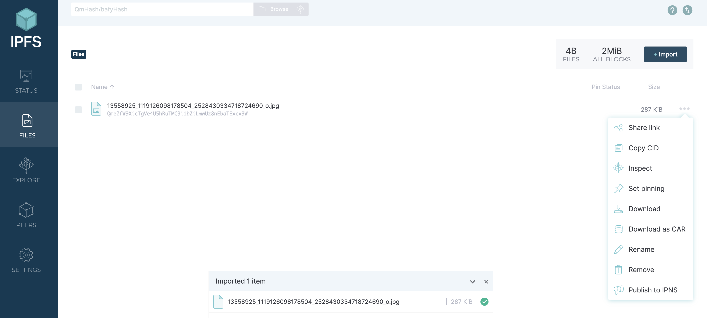
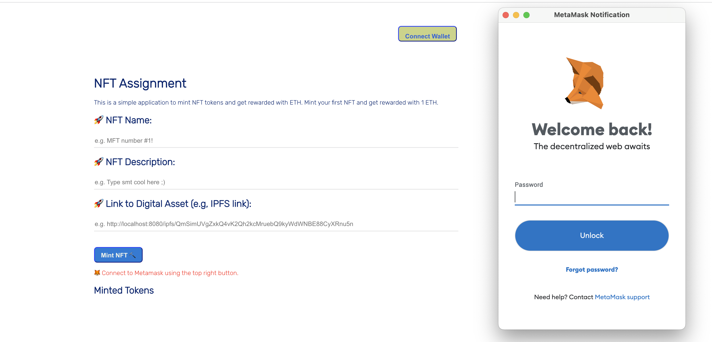
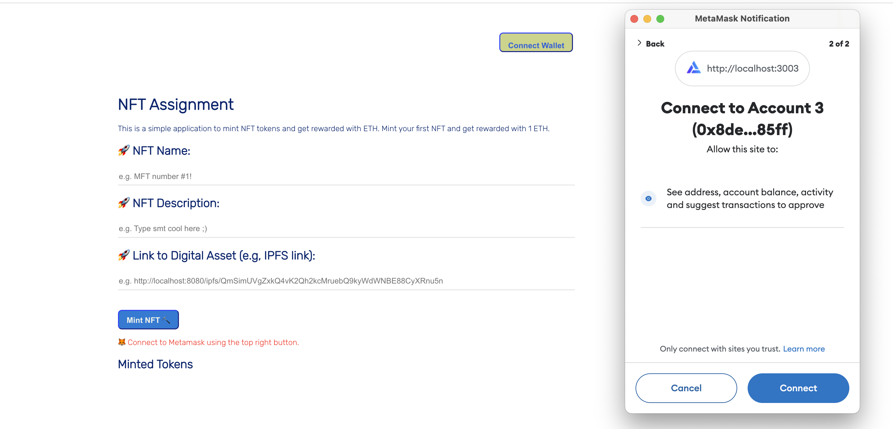
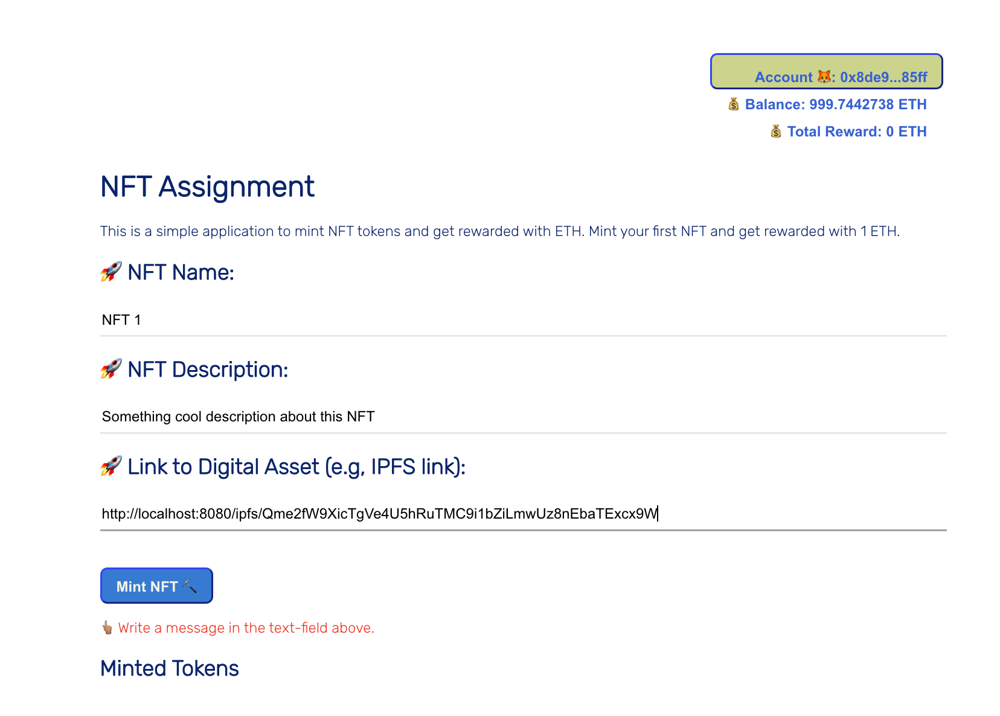
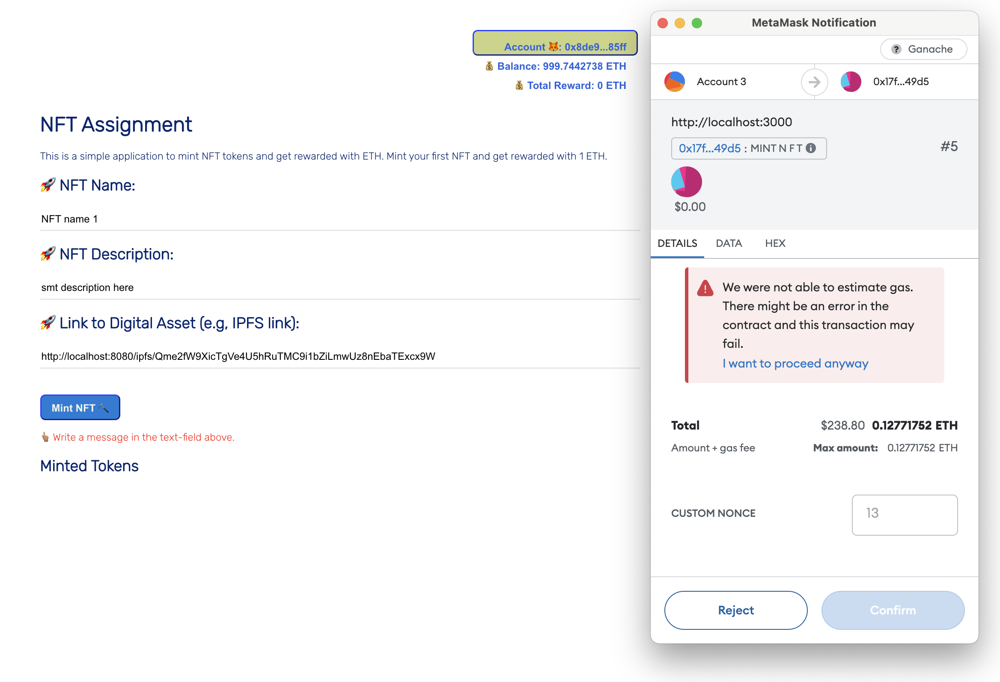
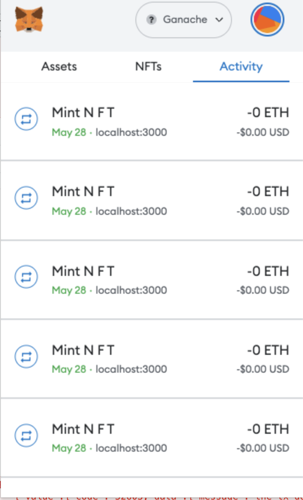

# Create local blockchain and deploy smart contract 

In this part, I first design a PoC of NFT minting on local blockchain. This PoC will be used to test the smart contract and the frontend. The user workflow should be:

- Each user login in platform using metamask and mint a NFT.
- The user can see the NFTs that he/she minted.
- The user can see the NFTs that he/she owned.
- The user get reward for minting NFTs (in ETH or token). 

Then, I will deploy the smart contract to AWS Blockchain.

## 1. Create local blockchain

### Step 1. Clone the repository:
```shell
git clone https://github.com/lamnd09/nft-minting-on-AWS-boilerplate.git
cd nft-minting-on-AWS-boilerplate
```
### Step 2. Running the Dapp 
 For local testing 
 * Create a local Ethereum network using ganache-cli 
```bash
cd net_Blockchain
ganache-cli -a 20 -e 1000  -m "test test test test test test test test test test test okay" -i 1337

Available Accounts
==================
(0) 0x8dE930dbAd0D99759Db57C2F906010f87D4185FF (1000 ETH)
(1) 0x9032969C6ac84f644bA65E40089ce221053ad624 (1000 ETH)
(2) 0xA1e77EC2f0ad59121DA812cd5be61E3CAc30F472 (1000 ETH)
(3) 0x363404432Aa9d4EF5629f80DAcFF0CD389dd38c8 (1000 ETH)
(4) 0x5c22Fd2D3E9eB70EF3585E0F895eE4d076d04414 (1000 ETH)
(5) 0xF221a97B436f16b8a2916eA232f45D5f5C5DAD10 (1000 ETH)


Private Keys
==================
(0) 0xaefcaad212aba1ac9c96f94f5dcef495467fb745179976fbe31711bc559fedcf
(1) 0xb2152533065ded1085494e704786c14e4258097fba26273adf5f44645fca17d2
(2) 0xceb1d8bc2c141e448d3d31fb5671a1b03a552a8d5ec683ad9513aa8289b84a8b
(3) 0x8ab686ec316e15671f09cceaf463d8d2bca58d87852f7f245aef86a787834abc
(4) 0x5263a193a48c089e9320320bac29b0fbd89c3e1abc5e8c3bc938b87dd4e4de15
(5) 0xc1a2ac12f6560e32fcac5ab7631bd6282c20e2b37abd307ed29ab033db3b1584

```

### Smart Contract Development
In this example, I quickly develop a simple smart contract based on ERC 721

In the `/net_Blockchain/contracts/` create a `MyNFT.sol` smart contract as below:

```solidity
// SPDX-License-Identifier: MIT
pragma solidity ^0.8.17;

import "@openzeppelin/contracts/token/ERC721/extensions/ERC721URIStorage.sol";
import "@openzeppelin/contracts/utils/Counters.sol";
import "@openzeppelin/contracts/access/Ownable.sol";

contract MyNFT is ERC721URIStorage, Ownable {
    using Counters for Counters.Counter;
    Counters.Counter private _tokenIds;

    // Mapping to track the rewards received by each user
    mapping(address => uint256) private rewardsReceived;
    // Mapping to track the NFTs minted by each user
    mapping(address => uint256[]) private userMintedTokens;
    // Mapping to check if a token has already been minted
    mapping(string => bool) private tokenExists;

    constructor() public ERC721("MyNFT", "NFT") {}

    function mintNFT(address recipient, string memory tokenURI)
        public
        returns (uint256)
    {
        require(!tokenExists[tokenURI], "Token already exists");

        _tokenIds.increment();

        uint256 newItemId = _tokenIds.current();
        _mint(recipient, newItemId);
        _setTokenURI(newItemId, tokenURI);

        // Reward the user with 1 ETH.
        rewardUser(recipient);

        // Track the NFTs minted by the user
        userMintedTokens[recipient].push(newItemId);

        // Mark the token as minted
        tokenExists[tokenURI] = true;

        return newItemId;
    }

    function rewardUser(address user) internal {
        uint256 rewardAmount = 1 ether;

        require(address(this).balance >= rewardAmount, "Not enough Ether to reward user");

        // Update the rewardsReceived mapping
        rewardsReceived[user] += rewardAmount;

        // Transfer the reward to the user.
        (bool success, ) = payable(user).call{value: rewardAmount}("");
        require(success, "Failed to send Ether");

        emit UserRewarded(user, rewardAmount);
    }

    // This function allows the contract owner to deposit ETH into the contract
    function depositETH() public payable {}

    // This function will allow the owner to withdraw all the remaining ETH.
    function withdrawETH() public onlyOwner {
        uint balance = address(this).balance;
        payable(owner()).transfer(balance);
    }

    // Function to get the total amount of rewards an user received
    function totalRewards(address user) public view returns (uint256) {
        return rewardsReceived[user];
    }

    // Function to get all tokens minted by a user
    function getMintedTokens(address user) public view returns (uint256[] memory) {
        return userMintedTokens[user];
    }

    // Function to check if a token with a given URI already exists
    function checkTokenExists(string memory tokenURI) public view returns (bool) {
        return tokenExists[tokenURI];
    }

    // Event emitted when a user is rewarded
    event UserRewarded(address indexed user, uint256 rewardAmount);
}
```

Then, we can deploy the smart contract to local Blockchain
```bash
truffle migrate --reset --network development
```
The output looks like:
```bash
Replacing 'MyNFT'
   -----------------
   > transaction hash:    0x4d0d1f950227b8bec0be43a14362ca8ed5e9e282dcc94f1beb1d154e2ab01fde
   > Blocks: 0            Seconds: 0
   > contract address:    0xF50bF71285c0f9Eb09473100c12Aa28E2AE6E380
   > block number:        2
   > block timestamp:     1685077850
   > account:             0x8dE930dbAd0D99759Db57C2F906010f87D4185FF
   > balance:             999.91790376
   > gas used:            2932220 (0x2cbdfc)
   > gas price:           20 gwei
   > value sent:          0 ETH
   > total cost:          0.0586444 ETH
```

[Optional] In case you want to create a token to reward use instead of using ETH, you need to create another smart contract named `RewardToken.sol` as below: 
```solidity
// SPDX-License-Identifier: MIT
pragma solidity ^0.8.17;

import "@openzeppelin/contracts/token/ERC20/ERC20.sol";

contract RewardToken is ERC20 {
    constructor() ERC20("RewardToken", "RKT") {
        _mint(msg.sender, 1000000 * (10 ** uint256(decimals())));
    }
}
```
and deploy it as : 
```bash
   Replacing 'MyNFT'
   -----------------
   > transaction hash:    0x4d0d1f950227b8bec0be43a14362ca8ed5e9e282dcc94f1beb1d154e2ab01fde
   > Blocks: 0            Seconds: 0
   > contract address:    0xF50bF71285c0f9Eb09473100c12Aa28E2AE6E380
   > block number:        2
   > block timestamp:     1685077850
   > account:             0x8dE930dbAd0D99759Db57C2F906010f87D4185FF
   > balance:             999.91790376
   > gas used:            2932220 (0x2cbdfc)
   > gas price:           20 gwei
   > value sent:          0 ETH
   > total cost:          0.0586444 ETH
```
Running the test for smart contract 
```bash
truffle test --network development

  Contract: MyNFT
    ✔ should mint a new NFT (315ms)
    ✔ should fail when minting a token with a URI that already exists (688ms)
    ✔ should deposit ETH (70ms)
    ✔ should withdraw all ETH (147ms)
```

## 2. IPFS Storage 

We're going to need to configure this metadata as a JSON object and store it, so we can pass it in as the tokenURI parameter when calling our smart contract's mintNFT function.

The text in the "Link to NFT", "Name", "Description" fields will comprise the different properties of our NFT's metadata. We'll format this metadata as a JSON object, but there are a couple options for where we can store this JSON object:

* We could store it on the Ethereum blockchain; however, doing so would be SUPER expensive (we're talking upwards of hundreds of dollars) due to the nature of Ethereum. ❌
* We could store it on a centralized server, like AWS or Firebase. But that would defeat our decentralization ethos. ❌
* We could use IPFS, a decentralized protocol and peer-to-peer network for storing and sharing data in a distributed file system. As this protocol as decentralized and free, it is our best option! ✅

To store our metadata on IPFS, we will use `ipfs-http-client`, a convenient IPFS API and toolkit. 

Run below commands to start ipfs services
```bash
ipfs init
ipfs daemon
ipfs config --json API.HTTPHeaders.Access-Control-Allow-Origin '["http://localhost:3000"]'
ipfs config --json API.HTTPHeaders.Access-Control-Allow-Methods '["PUT", "POST", "GET"]'
```

Then select any item in your local folder and add it to IPFS using the following command:
```bash
ipfs add <file_name>
```
copy the hash e.g, `QmewEXjVzGQHmWzUVJopEgSsPrkd9npS4boyW2PNGGKVFv`
 of the file and paste it in the browser to see the file. For example, 

```bash
http://localhost:8080/ipfs/Qme2fW9XicTgVe4U5hRuTMC9i1bZiLmwUz8nEbaTExcx9W
http://localhost:8080/ipfs/QmewEXjVzGQHmWzUVJopEgSsPrkd9npS4boyW2PNGGKVFv
http://localhost:8080/ipfs/QmQ8dpUy2m4D11o489hkgrF2ttW5ftdPSbzmb6qcHKTGGj
```



## 3. User Journey

* Click on connect Wallet button to login using Metamask 



and select associated account to work with the app.



Write some metada to mint a NFT 



The NFT is minted and the user get reward for minting NFTs (in ETH or token).



The user can see the NFTs that he/she minted.



In the next step, you copy the url and paste it in the `Link to Digital Asset` field in the frontend.