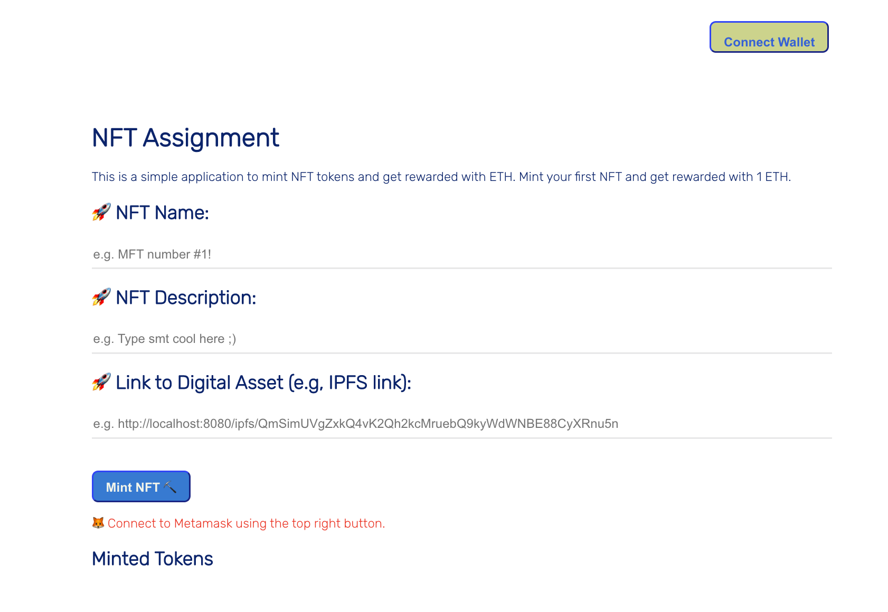

# Front-end setup 

## Install dependencies

From root repository, you move to `frontend` folder and run the following command:
```bash
cd frontend
npm install
```
In case you want to create a completely new project, you can run the following command:
```bash
npx create-react-app frontend
```

The structure of folder could be 

```bash
├── package.json
├── package-lock.json
├── public
│   ├── favicon.ico
│   ├── index.html
│   ├── logo192.png
│   ├── logo512.png
│   ├── manifest.json
│   └── robots.txt
├── src
│   ├── App.css
│   ├── App.js
│   ├── App.test.js
│   ├── contract-abi.json
│   ├── index.css
│   ├── index.js
│   ├── Minter.js
│   ├── reportWebVitals.js
│   ├── rewardtoken-abi.json
│   ├── setupTests.js
│   └── utils
│       ├── depositEthereum.js
│       ├── deposit_token.js
│       ├── getMintedTokens.js
│       ├── getRewardBalance.js
│       ├── interact.js
│       └── ipfs.js
└── yarn.lock
```

## Run the app

```bash
npm start
```
The frontend looks like: 



Login with the account you created with Metamask (or account in AWS Cognito), you can see the dashboard. 

## Deploy the app

```bash
npm run build
```

## Reference

[1] ReacrJS: https://reactjs.org/docs/getting-started.html

[2] Alchemy NFT minting tutorial: https://docs.alchemy.com/docs/nft-minter